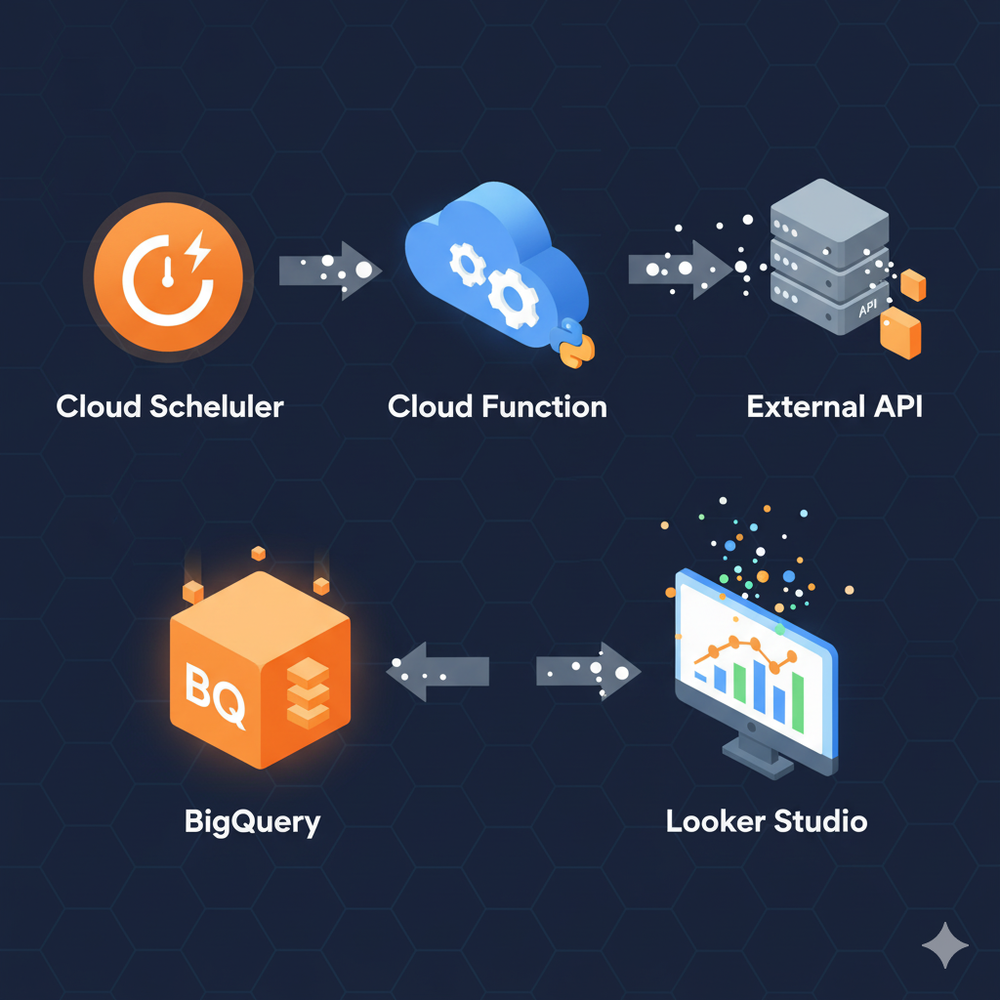

# Serverless Stock Data ETL Pipeline on Google Cloud Platform

This project implements a fully serverless **ETL (Extract, Transform, Load)** data pipeline on the Google Cloud Platform (GCP). The goal is to automatically extract daily stock market data from a public API, transform it into a clean and useful format, and load it into a BigQuery Data Warehouse for real-time analysis and visualization.

### 📜 Table of Contents

1.  [Project Description](#-project-description)
2.  [Solution Architecture](#-solution-architecture)
3.  [Technologies Used](#-technologies-used)
4.  [How to Replicate](#-how-to-replicate-the-project)
5.  [Final Result: Dashboard](#-final-result-dashboard)
6.  [Author](#-author)

---

### 📝 Project Description

This pipeline was developed as a portfolio project to demonstrate skills in data engineering, cloud architecture, and data visualization. The solution automates the entire process of collecting, processing, and serving financial data, turning raw JSON responses from the Alpha Vantage API into actionable insights on an interactive dashboard.

**The ETL process consists of:**
* **Extract:** A daily-triggered Cloud Function fetches the last 100 days of historical stock data for Apple Inc. (AAPL) from the Alpha Vantage API.
* **Transform:** The same function leverages the **Pandas** library in Python to clean the data, convert data types, rename columns, and calculate a new metric (a 7-day moving average of the closing price).
* **Load:** The processed Pandas DataFrame is loaded into a **BigQuery** table, which acts as our Data Warehouse. The table is overwritten daily to keep the data current.

---

### 🏛️ Solution Architecture

The architecture is designed to be 100% serverless, ensuring scalability, low cost, and minimal operational overhead.

**Data Flow:**
1.  **Cloud Scheduler:** Acts as a cron job, triggering the pipeline on a set schedule (e.g., daily).
2.  **Cloud Function:** The core of the ETL logic. This serverless Python function is executed by the trigger.
3.  **External API:** The function calls the Alpha Vantage API to fetch the raw stock data.
4.  **BigQuery:** The transformed and cleaned data is loaded into BigQuery, serving as the single source of truth for analysis.
5.  **Looker Studio:** The BI tool connects directly to BigQuery to create and display an interactive dashboard.

---

### 🛠️ Technologies Used

* **Google Cloud Platform (GCP):**
    * ☁️ **Cloud Functions:** Serverless environment to run the Python ETL code.
    * ⏰ **Cloud Scheduler:** Cron service for daily pipeline automation.
    * 🗃️ **BigQuery:** Serverless Data Warehouse for storing the processed data and running analytical queries.
    * 📊 **Looker Studio:** Business Intelligence tool for creating the interactive dashboard.
* **Languages & Libraries:**
    * 🐍 **Python:** Main language for the ETL logic.
    * 🐼 **Pandas:** Library for the data transformation and cleaning step.
    * 📦 **Requests:** Library for consuming the data API.
* **Other:**
    * 🐙 **Git & GitHub:** For code versioning and project documentation.

---

### 🚀 How to Replicate the Project

1.  **Prerequisites:** A Google Cloud Platform account with billing enabled and a free API key from Alpha Vantage.
2.  **GCP Setup:**
    * Enable the Cloud Functions, Cloud Scheduler, and BigQuery APIs.
    * Create a BigQuery Dataset and Table using the schema provided in `/sql/schema.sql`.
3.  **Deploy the Cloud Function:**
    * Create a 1st Generation Cloud Function.
    * Upload the files from the `/src` folder (`main.py` and `requirements.txt`).
    * Set the Entry Point to `extrair_transformar_acoes`.
    * Add your Alpha Vantage API key as a runtime environment variable named `ALPHA_VANTAGE_API_KEY`.
4.  **Configure IAM Permissions:**
    * Grant the `BigQuery Data Editor` and `BigQuery Job User` roles to the Cloud Function's service account.
5.  **Schedule the Job:**
    * Create a job in Cloud Scheduler to call the function's HTTP trigger URL on your desired frequency.

---

### 📈 Final Result: Dashboard

The interactive dashboard allows for the analysis of the stock's historical performance, visualizing the closing price, moving average, and trading volume.

🔗 **[Access the Interactive Dashboard Here!](https://lookerstudio.google.com/s/v14MoPXxUPU)**

---

### 👨‍💻 Author

Made with ❤️ by **Lucas Cardoso**

